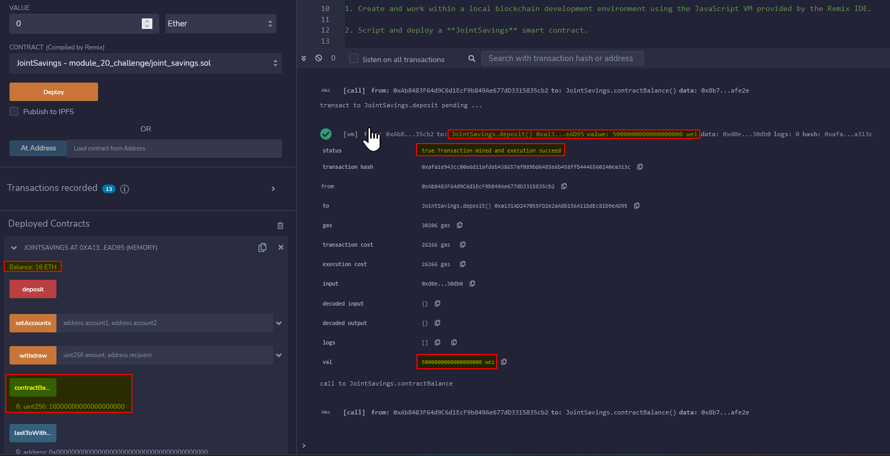
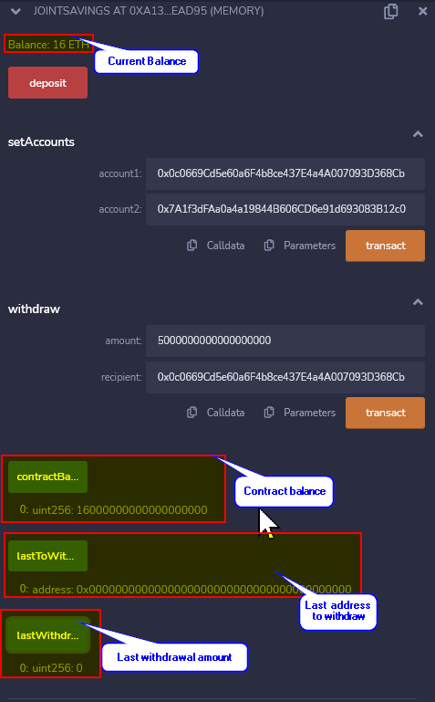

# Joint Savings Account Automation

## Objective
To build a smart contract to automate the creation of and transactions related to joint savings accounts using the `solidity` language.

## Approach
Using `solidy` and the `Ethereum` network, this application will create a smart contract object containg the following properties:
* A payable address for account `one`
* Apayable address for account `two`
* The address which the last withdrawal was made to
* The last withdrawal amount and
* The current contract balance

The contract object also includes the following methods:
* `withdraw` amount to a recipient (accounts `one` or `two`)
* `deposit` which updates the balance of `this` contract
* `setAccounts` which accepts two addresses which are assigned to accounts `one` and `two`
* `anonymous` fallback function to accept payments sent outside the `deposit` method

## Testing
### Environment
The testing was carried in the `Javascript VM` provided by `Remix`.

### Results
#### Before test cases:

#### Test case 1: Setting up accounts `one` and `two` before:

#### Test case 1: Setting up accounts `one` and `two` after:

#### Test case 2: Depositing 1 `ether` in `wei` before:

#### Test case 2: Depositing 1 `ether` in `wei` after:

#### Test case 3: Depositing 10 `ether` in `wei` before:

#### Test case 3: Depositing 10 `ether` in `wei` after:

#### Test case 4: Depositing 5 `ether` before:

#### Test case 4: Depositing 5 `ether` after:

#### Test case 5: Withdrawing 5 `ether` from account `one` before:

#### Test case 5: Withdrawing 5 `ether` from account `one` after:

#### Test case 6: Withdrawing 10 `ether` from account `two` before:

#### Test case 6: Withdrawing 10 `ether` from account `two` after:

